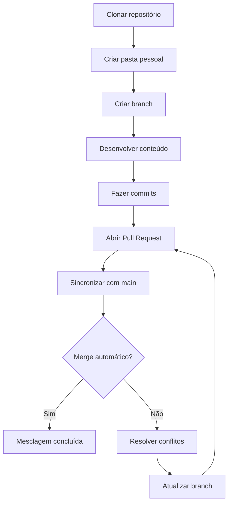

# Projeto de Prática - GitHub Projects e Branches

Este repositório é utilizado na atividade prática de GitHub Projects, Issues, Branches e Pull Requests.

## 📝 Instruções

Cada aluno deve:

✅ Criar sua própria branch seguindo o padrão: `feature-nomeAluno`  
✅ Criar um arquivo `README.md` com a ideia do seu projeto fictício ou real  
✅ Fazer um Pull Request para a branch `main`  
✅ Aguardar a análise e aprovação do professor  


## 🎯 Objetivo


Praticar:
# Fluxo de Trabalho Colaborativo com Git

## Passo a Passo para Iniciantes

### 1. Clonar o Repositório Principal  
```bash
git clone https://github.com/nome-do-projeto.git
```
- **Objetivo:** Criar uma cópia local do projeto  
- **Pasta criada:** `nome-do-projeto` (acesse com `cd nome-do-projeto`)

---

### 2. Organização Pessoal  
```bash
mkdir seu_nome   # Ex: mkdir carlos_oliveira
cd seu_nome
```
- **Por quê?** Evitar conflitos com arquivos de outros colaboradores  
- **Boas práticas:**  
  ✅ Use apenas letras minúsculas e underscores  
  ✅ Não use espaços ou caracteres especiais  

---

### 3. Criação de Branch  
```bash
git checkout -b feature/sua-funcionalidade  # Ex: git checkout -b feature/calculo-imc
```
- **Estrutura recomendada:**  
  `tipo/nome-descritivo`  
  - Tipos comuns: `feature/`, `fix/`, `docs/`  
- **Importante:** Nunca trabalhe diretamente na branch `main`!

---

### 4. Desenvolvimento do Conteúdo  
1. Crie arquivos na sua pasta (ex: `script.py`, `README.md`)  
2. Escreva o código/documentação  
3. Salve frequentemente  

**Exemplo de README.md:**  
```markdown
# Cálculo de IMC  
## Objetivo  
Programa para calcular Índice de Massa Corporal  

## Funcionalidades  
- [x] Entrada de peso e altura  
- [ ] Classificação nutricional  
```

---

### 5. Versionamento das Alterações  
```bash
git add .                            # Adiciona TODAS as mudanças
git commit -m "Adiciona cálculo IMC" # Mensagem clara e objetiva
git push origin feature/sua-funcionalidade
```
- **Regras de commit:**  
  🔹 1 commit = 1 funcionalidade lógica  
  🔹 Mensagens no imperativo ("Adiciona", "Corrige")  

---

### 6. Pull Request (Integração)  
1. Acesse o repositório no GitHub/GitLab  
2. Clique em **"Pull Requests"** > **"New Pull Request"**  
3. Selecione:  
   - `base repository`: projeto principal  
   - `base`: main  
   - `compare`: sua branch  
4. Descreva:  
   ```markdown
   ## O que foi feito?
   - Implementação do módulo de cálculo IMC
   
   ## Por que é necessário?
   - Parte do requisito RQF-203 do projeto
   ```

---

### 7. Sincronização com a Main (Evitar Conflitos)  
```bash
git checkout main
git pull origin main          # Atualiza sua main local
git checkout feature/sua-branch
git merge main                # Traz atualizações para sua branch
```
- **Quando fazer?**  
  ⏰ Antes de iniciar novas tarefas  
  ⏰ Sempre que a main for atualizada  
  ⏰ Antes de enviar um PR  

---

### 8. Resolução de Conflitos  
**Se o `git merge` mostrar erros:**  
1. Abra os arquivos conflitantes (busque por `<<<<<<<`, `=======`, `>>>>>>>`)  
2. Decida qual versão manter:  
   ```python
   <<<<<<< HEAD
   def calcular_imc(peso, altura):
   =======
   def imc(peso, altura_cm):
   >>>>>>> main
   ```  
3. Corrija e salve:  
   ```python
   def calcular_imc(peso, altura_cm):
       altura_m = altura_cm / 100
       return peso / (altura_m ** 2)
   ```  
4. Finalize a correção:  
   ```bash
   git add arquivo_corrigido.py
   git commit -m "Resolve conflito na função IMC"
   ```

---

## Fluxograma do Processo  


## Dicas Críticas  
- 🔄 **Sincronização frequente:** Execute `git pull origin main` pelo menos 2x/dia  
- 🪓 **Branches efêmeras:** Apague branches mescladas no repositório remoto  
- 💬 **Comunicação:** Avise colegas se for editar arquivos fora da sua pasta  
- 🚨 **Testes locais:** Sempre rode testes antes do push  

> **Nota para o Professor:**  
> Este documento cobre 95% dos cenários comuns em projetos acadêmicos. Para situações avançadas (rebase, stash, tags), consulte a [documentação oficial do Git](https://git-scm.com/doc).

